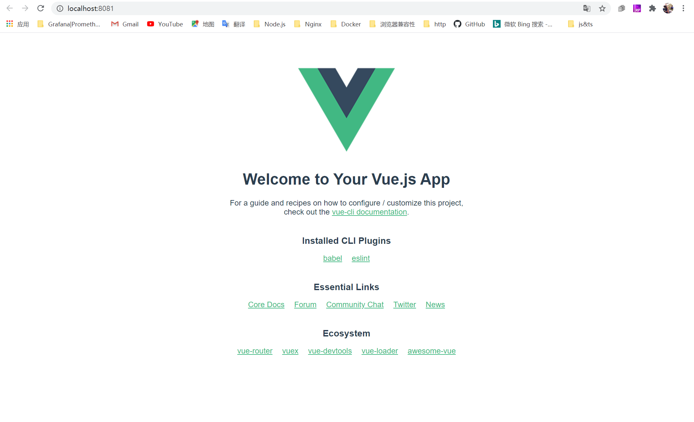
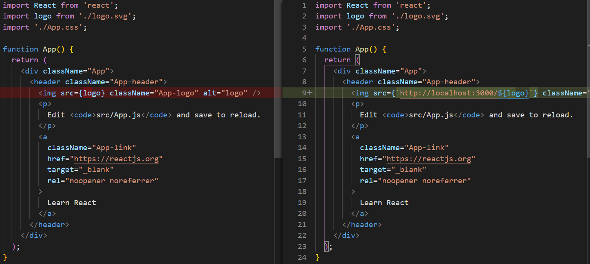
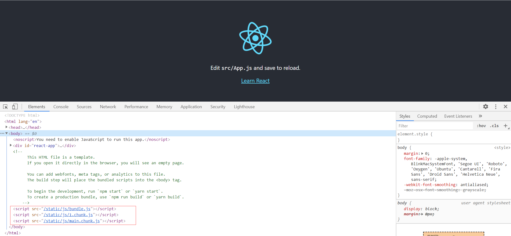
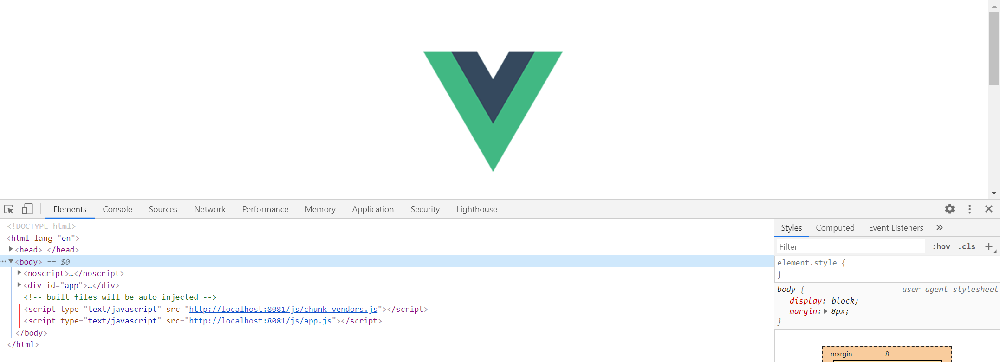
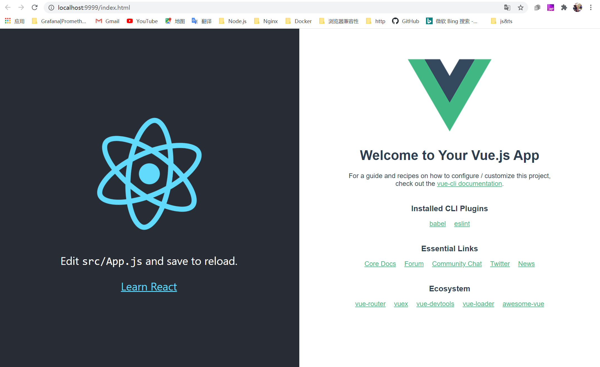
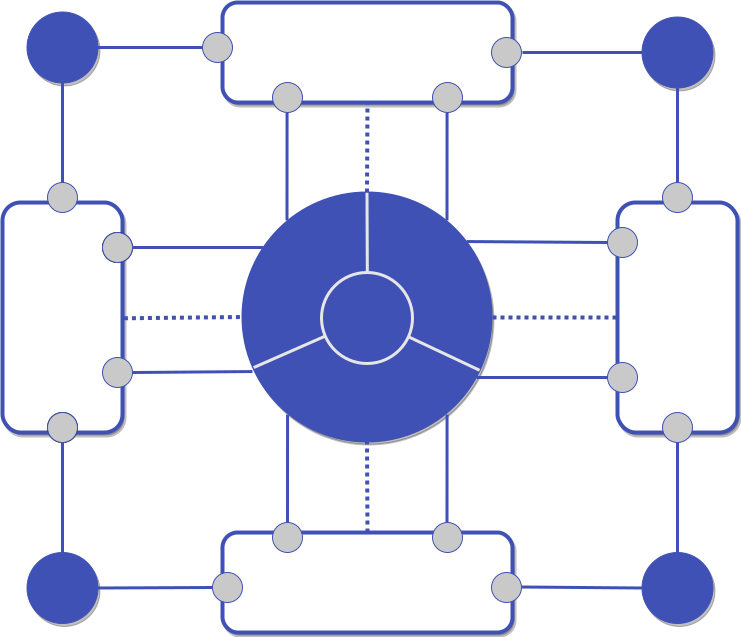

# 介绍
-----------
obvious是一个轻量级渐进式微前端框架，在微前端架构中，obvious专注于解决前端微应用的依赖编排和应用间的通信问题，旨在通过简洁易懂，符合编程直觉的API以及灵活的中间件机制，帮助用户快速搭建好基础微前端体系，并支持进行更深层次地定制，从而实现完整可靠的微前端架构

## 关于微前端
前端在软件工程中是迭代更新速度比较快的一个领域，虽然前端人常以"学不动了"自嘲，但是客观地说，技术演进是问题复杂度增加，量变引起质变的结果，新的技术出现后能解决更复杂的问题，反之又驱动了问题复杂度的增加。因此前端的快速更新正说明了前端在业务中能做的事情越来越多，地位越来越重要。

最初的前端开发者只做一些静态页面和处理简单的交互，那时刀耕火种地操作原生DOM和使用锋利的jQuery尚且可以应付，后来Ajax技术的风靡带来了前后端分离的浪潮，以前很多由JSPer、PHPer做的事情被交给了javaScripter，前端开发者需要将大量后端接口传回来的数据与UI进行映射，这时候再由开发人员去手动操作DOM就异常痛苦，而三大史诗级框架Angular、React和Vue的出现一举拯救了水深火热中的前端开发者，这三个框架的功能就是把数据与DOM做自动的实时映射，让开发人员只用关注数据，不用再操作DOM。紧接着，单页应用的出现让页面间的数据交换也不必再经过后端，这让前端的体量更大，应用架构以及需要管理的数据的复杂度也变得更大，对于一些to B的应用，有时动辄有几十甚至几百个页面需要管理，很容易变成脆弱和难以维护的巨石应用，这时候，问题复杂度量变引起的质变就是微前端架构的出现。

我们希望引进像后端微服务一样的架构体系，让前端应用也能做到：
1. 应用间技术栈解耦，互不感知，可增量升级
2. 应用间代码仓库和开发团队解耦，每个应用提供相对独立的功能，由相对独立的团队开发和维护
3. 应用间部署解耦，每个微应用可以单独部署和发布，然后在一个集合应用中编排和聚合
4. 应用可以在同一个页面上聚合，且具备相互通信的能力，可以做到跨script的数据交换

> [micro frontend](https://martinfowler.com/articles/micro-frontends.html)

## 业界实践
微前端是一个说旧不旧,说新不新的概念，目前比较知名的开源微前端库有国外的[single-spa](https://single-spa.js.org/)， 国内的阿里基于此封装的[qiankun](https://qiankun.umijs.org/zh/guide)以及同样出自阿里的相对独立的微前端库[icestark](https://ice.work/docs/icestark/about)，同时，在各种前端交流会议中，许多公司也分享了自己的微前端解决方案，综合网络上的各种资料，可以大致总结出微前端落地过程中需要解决的几个问题：

1. 微应用的资源如何注册和加载（编排）
2. 微应用间如何通信（通信）
3. 微应用间如何保证全局变量和样式互不影响（容器）

## 关于obvious
事实上，我所在的公司也有自己的微前端实现方案，在使用该方案过程中，我发现针对上面所说的三个问题，解决前两个是架构的基础和刚需，是否有灵活优雅的注册和加载机制以及方便的通信机制是衡量一个微前端框架使用体验的最重要指标，可惜我个人觉得公司内部的实现方案给开发人员的体验实在是太糟糕了。而了解业界其他方案的过程中，我发现当前的主流微前端库似乎都是通过硬编码的方式注册应用资源，然后在主应用上通过劫持路由来识别微应用并加载资源，我觉得这依然不够灵活。同时，针对应用间的通信，除了icestark有提供一个eventBus之外，其他两个框架好像鲜有提及。而社区讨论的热点似乎主要是在于如何解决第三个问题——一个在我看来属于锦上添花的功能。正是上面的这些原因让我萌生了写一个自己的基础微前端框架的想法，于是就有了obvious.js

> 我只粗略浏览过其他微前端库的文档，没有具体实践应用过，如果对其他框架的理解有误，欢迎指正

obvious.js是一个轻量级，渐进式的微前端框架，它专注于解决微应用的编排和通信问题，它的特点是：
- 提供基于全局状态、事件广播，事件单播的通信能力，通信机制灵活方便
- 支持在定义微应用时声明依赖关系，激活微应用时自动激活依赖, 让微应用可以自由拆分与合设
- 灵活的中间件机制，开放资源加载中间件，让开发者能够以编写中间件的形式自由定制资源的统一注册和加载规则，实现自动化注册；同时开放资源运行中间件，让开发者能优雅接入日志，js沙箱等功能
- 天然支持单屏页面中加载多个微应用，可以基于它封装出高阶的spa微前端框架，同时微应用激活条件完全由开发者自由制定，不再局限于路由劫持
- 概念简单，函数式API清晰易理解，可以做到脱离文档开发

这是我在一个又一个996之后挤出时间开发的项目，如果能帮助你解决业务中的问题或者让你感觉有所收获，希望您能给我的github仓库点一个小小的star以示鼓励，如果愿意提issue或者pull request帮助我改进它就更好了。

接下来，我将带你完整实现一个用obvious搭建微前端环境，并在该环境上把react官方脚手架create-react-app和vue官方脚手架vue-cli开发并部署的两个微应用集成在一起的小示例，带你走进obvious.js


# 教程
---------
> 本教程假设你掌握react和vue框架的基础知识，能理解react hook的使用和vue2的模板语法。如果你还不了解这方面的相关知识，不要急，先快速跟着两大框架的官方文档学习一下吧！

## 目标

经过本教程的学习，你将开发出一个效果如上图的简单微前端应用：
- 用create-react-app创建的一个react工程，被部署在 http://localhost:3000
- 用vue-cli创建的一个vue工程，被部署在 http://localhost:8081
- 上面的两个工程在 http://localhost:9999 上聚合，且在页面交互上能做到：
    - 在react区域的输入框中输入的文字，能在vue区域作为标题实时显示
    - 在vue区域可以通过点击绿色按钮控制react图标是否旋转
    - 点击vue区域的标题，react区域的输入框获得焦点

你可以在[这里](https://github.com/run-nan/obvious/tree/dev/examples)查看教程示例的源码

## 准备工作
首先，我们参照[create-react-app](https://github.com/facebook/create-react-app#creating-an-app)和[vue-cli](https://cli.vuejs.org/)官方教程的说明，分别创建一个叫做react-app的react工程和一个叫做vue-app的vue工程，在本地开启dev-server伺服后，react-app被部署在 http://localhost:3000 上

vue-app被部署在 http://localhost:8081 上


为了配合之后的聚合，我们分别修改一下应用挂载点，微调一下样式，并修改publicPath

react-app做如下修改：




vue-app做如下修改：


我们最终要将这两个应用在 http://localhost:9999 上聚合，因此需要搭建一个宿主环境
> 如果不了解前端构建和Node.js的一些基础知识，下面的部分内容可能会让你感觉有些难以理解，你可以选择直接复制教程中的代码，而不必理解为什么要这么做

由于react-app和vue-app都是用webpack-dev-server伺服的，因此它们的源码中都会带上实现热更新功能的代码，如果宿主环境也是用webpack-dev-server伺服的话，错误的热更新请求会让宿主环境dev-server挂掉。因此，我们选择用webpack以watch模式打包宿主代码，并用Node.js起http服务端伺服。由于这个示例只在现代浏览器上演示，所以我们的webpack配置一切从简，只使用一个html-webpack-plugin，将打包好的代码注入到html模板中。
```js
// ./host-enviroment/main.js
alert("I'm ready to learn obvious.js");
```
```js
// ./host-enviroment/webpack.config.js
const path = require('path');
const HtmlWebpackPlugin = require('html-webpack-plugin');

module.exports = () => {
    const entry = {
        'main': path.resolve(__dirname, './main.js')
    };

    const plugins = [
        new HtmlWebpackPlugin({
            template: path.join(__dirname, './index.template.html')
        })
    ];

    return {
        entry,
        devtool: 'source-map',
        plugins
    }
};
```
在我们的宿主html中，需要为react-app和vue-app预留好挂载点, 并布置好一个应用各占屏幕一半的样式
```html
<!--  ./host-enviroment/index.template.html   -->
<!DOCTYPE html>
<html lang="en">
    <meta charset="utf-8">
    <meta http-equiv="X-UA-Compatible" content="IE=edge">
    <meta name="viewport" content="width=device-width,initial-scale=1.0">
    <title>obvious demo</title>
    <style>
        body {
            display: flex;
        }

        #react-app {
            flex: 1;
        }

        #vue-app {
            flex: 1
        }
    </style>
  </head>
  <body>
    <noscript>
      <strong>We're sorry but obvious demo doesn't work properly without JavaScript enabled. Please enable it to continue.</strong>
    </noscript>
    <div id='react-app'></div>
    <div id="vue-app"></div>
    <!-- built files will be auto injected -->
  </body>
</html>
```
打包后，所有host-enviroment的静态资源会被打包到`./dist`目录，我们在开始打包后，用express把它伺服在 http://localhost:9999 
```js
// ./host-enviroment/server.js
const express = require('express');
const child_process = require('child_process');
const path = require('path');
const fs = require('fs');

const app = new express();

if (!fs.existsSync('./dist')) {
    fs.mkdirSync('./dist');
}

const childProcess = child_process.exec('npm run watch');
childProcess.stdout.pipe(process.stdout);
childProcess.stderr.pipe(process.stderr);

app.use(express.static(path.join(__dirname, './dist/')));

app.listen('9999', () => {
    setTimeout(() => {
        child_process.execSync('start http://localhost:9999/index.html');
    }, 3000);
});
```
配置一下npm script
```json
// ./host-enviroment/package.json
{
  "name": "host-enviroment",
  "version": "0.1.0",
  "description": "",
  "main": "index.js",
  "scripts": {
    "test": "echo \"Error: no test specified\" && exit 1",
    "watch": "webpack -w",
    "start": "node ./server.js"
  },
  "author": "",
  "license": "ISC",
  "devDependencies": {
    "express": "^4.17.1",
    "html-webpack-plugin": "^4.3.0",
    "webpack": "^4.44.0",
    "webpack-cli": "^3.3.12"
  }
}
```
这样我们就完成了构建你的第一个obvious应用的第一步
```
|--- react-app
|--- vue-app
|--- host-enviroment
     |--- main.js
     |--- index.template.html
     |--- server.js
     |--- webpack.config.js
     |--- package.json
```
在host-enviroment执行一下npm start，http://localhost:9999 被打开


最后，让我们在三个工程中都安装依赖 `npm install @runnan/obvious-core`

?> <strong>Now You are ready to learn obvious.js</strong>

## 资源注册和加载
并不难理解，react-app和vue-app上能呈现页面是因为加载了包含渲染逻辑的javaScript代码





现在我们要把这两个应用在 http://localhost:9999 上聚合，其实也只需要做同样的事情

?> 类比后端的概念，一个后端微服务本质上是一个或几个被编译为二进制的程序启动为进程后调度操作系统资源，一个前端微应用的本质是一个或几个被编译为原生js的script被加载到html中后调度DOM资源

在obvious中，专门做这件事情的是一个叫做Bus的对象，它是整个obvious微前端体系的内核，是调度不同微应用的枢纽。创建一个Bus时，你只需要把要聚合的微应用的资源信息告诉它，之后就可以用Bus提供的API调度前端资源和编排前端应用。

```js
// ./host-enviroment/main.js
import {createBus} from '@runnan/obvious-core';

const bus = createBus('host', {
    'react-app': {
        js: [
            'http://localhost:3000/static/js/bundle.js',
            'http://localhost:3000/static/js/1.chunk.js',
            'http://localhost:3000/static/js/main.chunk.js'
        ],
        isLib: true
    },
    'vue-app': {
        js: [
            'http://localhost:8081/js/app.js',
            'http://localhost:8081/js/chunk-vendors.js'
        ],
        isLib: true
    }
});

bus.activateApp('react-app');
bus.activateApp('vue-app');
```
我们在host-enviroment中创建了一个叫做host的Bus，声明了管理的微应用的资源，紧接着我们用创建出的Bus实例分别激活react-app和vue-app，“激活”这个操作会去加载app声明的资源，加载完成后，带着页面渲染逻辑的代码就会被执行，react和vue应用分别将各自的顶层组件挂载到我们预留好的挂载点上，页面就变成了这个样子


看起来还不错！

?> 你可能发现在声明资源时，我们添加了一个isLib属性，这告诉Bus现在加载的资源并不是一个app，而是一个library，后续的学习中你将会了解到二者的区别

## 应用通信
接下来让我们做点有趣的事情，我们尝试让两个app能靠通信机制实现UI交互，首先我们改造一下react-app，让它有一个input输入框，并微调一下它的样式：
```js
import React from 'react';
import logo from './logo.svg';
import './App.css';

function App() {
  const [text, setText] = React.useState('Hello Obvious');

  const handleOnChange = (e) => {
    setText(e.target.value);
  }
  
  return (
    <div className="App">
      <header className="App-header">
        
        <div>
            <div>Edit the text showed in vue area: </div>
            <input onChange={handleOnChange} value={text}></input>
        </div>
        <a
          className="App-link"
          href="https://reactjs.org"
          target="_blank"
          rel="noopener noreferrer"
        >
          Learn React
        </a>
      </header>
    </div>
  );
}

export default App;
```
对于vue-app，为了方便后续改造，我们把标题变成App组件的data，然后将其作为props传递给HelloWorld组件
```vue
// part of ./vue-app/src/App.vue
<template>
  <div id="app">
    
    <HelloWorld v-bind:msg="text"/>
  </div>
</template>

<script>
import HelloWorld from './components/HelloWorld.vue';

export default {
  name: 'App',
  components: {
    HelloWorld
  },
  data: function() {
    return {
      text: ''
    }
  }
}
</script>
```
很好，现在我们有了两个准备就绪的微应用，在宿主环境上还有一个名为host的Bus。Bus可以让消息在两个应用之间传递。我们只需要在微应用代码中获取这个Bus，并用它创建出通信插口——Socket
```js
import {getBus} from '@runnan/obvious-core';

const bus = getBus('host');
const socket = bus.createSocket();
```
obvious提供了一套状态管理机制，让不同的微应用可以通过读、写、监听同一个状态实现通信。在我们当前这个项目中，我们需要做的是把react-app的input框输入的内容传递给vue-app。react-app可以用刚刚创建的socket实例初始化一个名为text的状态，当输入内容变化时，通过socket.setState及时更新状态值
```js
// part of ./react-app/src/App.js
import React from 'react';
import {getBus} from '@runnan/obvious-core';

const bus = getBus('host');
const socket = bus.createSocket();

function App() {
  const [text, setText] = React.useState('Hello Obvious');

  React.useEffect(() => {
    socket.initState('text', 'Hello Obvious');
  }, []);

  const handleOnChange = (e) => {
    setText(e.target.value);
    socket.setState('text', e.target.value);
  }

  /**
   *  omitted code
   */
}
```

!> 重要规则：一个状态必须通过socket.initState初始化后才能被修改和监听，否则将抛出异常。obvious判断一个状态是否被初始化的依据是该状态的值是否是undefined，因此，将状态初始化为undefined也是不合法的

在vue-app中，我们同样用名为host的Bus创建一个socket，并用这个socket监听状态text，当状态变化时，更新组件的data
```js
// part of ./vue-app/src/App.vue
import HelloWorld from './components/HelloWorld.vue';
import {getBus} from '@runnan/obvious-core';

const bus = getBus('host');
const socket = bus.createSocket();

export default {
  name: 'App',
  components: {
    HelloWorld
  },
  data: function() {
    return {
      text: ''
    }
  },
  methods:{
    changeText: function(text){
      socket.waitState(['text']).then((state) => {
        this.changeText(state.text);
      });
      this.text = text;
    }
  },
  created: function() {
    socket.watchState('text', this.changeText);
  }
}
```
由于我们只有在状态初始化后才能监听和修改它，因此socket提供了waitState方法，让你可以等待一个或几个状态被初始化后才执行后续操作

## 应用编排

# 进阶
------
## App的生命周期
## 资源预加载
## 共享运行时
## 中间件
### 资源加载中间件
### 资源运行中间件
## 最佳实践
### 优雅地本地调试
### 绝对轻量引入
### 局部Bus通信

### 控制依赖关系

# API
------
## Bus
## Socket
## App

# 扩展生态
-------
## obvious-react
## obvious-vue
## obvious-cli
## obvious-spa

# 历史版本
-------

# 加入我们
-------

# 捐赠
-------